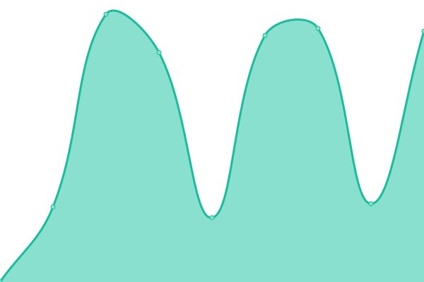
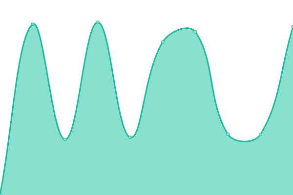
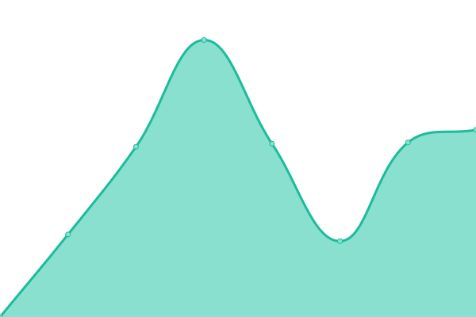
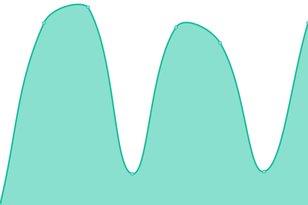

# [📈 Live Status](https://apikmeister.github.io/umt-web-uptime): <!--live status--> **🟩 All systems operational**

This repository contains the open-source uptime monitor and status page for [apikmeister](https://apikmeister.github.io/umt-web-uptime), powered by [Upptime](https://github.com/upptime/upptime).

With [Upptime](https://upptime.js.org), you can get your own unlimited and free uptime monitor and status page, powered entirely by a GitHub repository. We use [Issues](https://github.com/apikmeister/umt-web-uptime/issues) as incident reports, [Actions](https://github.com/apikmeister/umt-web-uptime/actions) as uptime monitors, and [Pages](https://apikmeister.github.io/umt-web-uptime) for the status page.

<!--start: status pages-->
<!-- This summary is generated by Upptime (https://github.com/upptime/upptime) -->
<!-- Do not edit this manually, your changes will be overwritten -->
<!-- prettier-ignore -->
| URL | Status | History | Response Time | Uptime |
| --- | ------ | ------- | ------------- | ------ |
|  [UMT Official Website](https://www.umt.edu.my) | 🟩 Up | [umt-official-website.yml](https://github.com/apikmeister/umt-web-uptime/commits/HEAD/history/umt-official-website.yml) | 

 4093ms
     
 | 

<a href="https://apikmeister.github.io/umt-web-uptime/history/umt-official-website">100.00%</a>
    

|  [Mynemo](https://mynemo.umt.edu.my) | 🟩 Up | [mynemo.yml](https://github.com/apikmeister/umt-web-uptime/commits/HEAD/history/mynemo.yml) | 

 3347ms
     
 | 

<a href="https://apikmeister.github.io/umt-web-uptime/history/mynemo">99.78%</a>
    

|  [Oceania](https://epembelajaran.umt.edu.my/oceania/) | 🟩 Up | [oceania.yml](https://github.com/apikmeister/umt-web-uptime/commits/HEAD/history/oceania.yml) | 

 5027ms
     
 | 

<a href="https://apikmeister.github.io/umt-web-uptime/history/oceania">100.00%</a>
    

|  [Wadi](https://epembelajaran.umt.edu.my/wadi/) | 🟩 Up | [wadi.yml](https://github.com/apikmeister/umt-web-uptime/commits/HEAD/history/wadi.yml) | 

 1935ms
     
 | 

<a href="https://apikmeister.github.io/umt-web-uptime/history/wadi">100.00%</a>
    

|  [Oasis](https://epembelajaran.umt.edu.my/oasis/) | 🟩 Up | [oasis.yml](https://github.com/apikmeister/umt-web-uptime/commits/HEAD/history/oasis.yml) | 

 1458ms
     
 | 

<a href="https://apikmeister.github.io/umt-web-uptime/history/oasis">100.00%</a>
    

|  [Bayou](https://bayou.umt.edu.my) | 🟩 Up | [bayou.yml](https://github.com/apikmeister/umt-web-uptime/commits/HEAD/history/bayou.yml) | 

 5752ms
     
 | 

<a href="https://apikmeister.github.io/umt-web-uptime/history/bayou">99.79%</a>
    

|  [e-spp](http://e-spp.umt.edu.my) | 🟩 Up | [e-spp.yml](https://github.com/apikmeister/umt-web-uptime/commits/HEAD/history/e-spp.yml) | 

 1704ms
     
 | 

<a href="https://apikmeister.github.io/umt-web-uptime/history/e-spp">99.79%</a>
    

<!--end: status pages-->

[**Visit our status website →**](https://apikmeister.github.io/umt-web-uptime)

## 📄 License

- Powered by: [Upptime](https://github.com/upptime/upptime)
- Code: [MIT](./LICENSE) © [apikmeister](https://apikmeister.github.io/umt-web-uptime)
- Data in the `./history` directory: [Open Database License](https://opendatacommons.org/licenses/odbl/1-0/)
